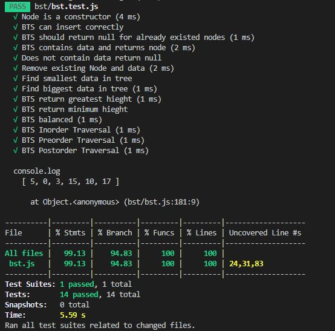
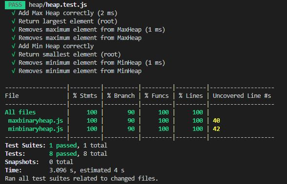

# Unit-testing Data Structures

Hi! I'm using **Jest** to unit test different data Structures! **Jest**  is a delightful JavaScript Testing Framework with a focus on simplicity. I will continue adding new data structures as time past!

## Binary Search Tree 
 

screenshot of **Code Coverage!**

## MinBinaryHeap and MaxBinaryHeap 
 

screenshot of **Code Coverage!**